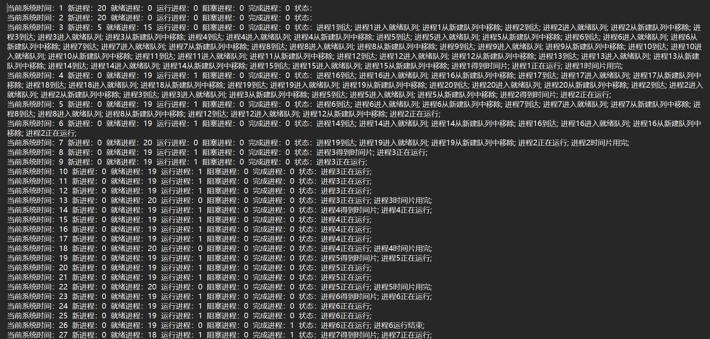

## 《操作系统课程设计》
# 实验三 -- 单处理机进程调度

> 姓名：庞晓宇 学号：2020118100


## 一、实验基本要求
1. 实验按100分计（含基本分75 + 扩展分25）：现场演示（50分），提交实验报告（打印或手写，25分），提供设计文档和源代码（电子文档，25分）。
2. 鼓励采用图形用户界面，有完善的I/O设计和容错处理者将有额外加分（最高20分）！
3. 随机检查（询问）3处代码或设计方案，答错一处扣20分！若发现演示或设计文档和源代码雷同者0分处。


## 二、实验内容与目的

### 实验内容
编写程序完成单处理器系统的进程调度，要求采用时间片轮转法调度策略。具体内容：
1. 确定PCB内容及其组织方式；
2. 要求模拟进程空闲（新）、就绪、运行、阻塞和完成5个状态；
3. 实现进程创建、进程调度、进程阻塞和进程唤醒4个原语；
4. 编写主函数对整个系统进程测试。

### 实验目的
1. 加深进程概念理解，明确进程与程序区别。
2. 理解操作系统中进程的组织、创建和调度等方法。


## 三、提示
关键三点：
1. 如何组织进程：
   - 确定PCB内容：标识信息、状态和运行时间与存储地址等信息、现场信息、管理信息
   - PCB组织方式：相同状态的进程PCB构成一个队列（即有空闲、就绪、运行、阻塞和完成5个队列）
2. 如何创建进程：
   - 申请PCB（从空闲队列） —> 申请资源 —> 填写PCB —> 挂就绪队列
3. 如何实现处理机调度及进程状态切换：
   - 采用先来先服务（FCFS）调度策略实现进程调度；
   - 从就绪队列选择一个进程；摘取PCB，挂运行队列；修改状态等PCB内容； 保存现场、恢复现场；
   - 模拟运行--可以按照两种场景模拟进程运行：
     1. 可以预先设置好各进程的运行时间、I/O时间、I/O发生的时刻等信息，之后操作系统控制进程运行，实现状态切换，直到全部进程完成。
     2. 亦可以采用人工干预方式控制进程状态切换（运行时间已预先设置），比如输入“Esc”进入“阻塞”状态，输入“Enter” 则选择（新）进程运行（进程调度），当前进程回到就绪状态;输入“wakeup”,再选择阻塞进程，则被选中的阻塞进程回到就绪状态；输入“finished”，当前进程运行结束，回到完成状态；
   - 修改（剩余）运行时间。

扩展
- 采用多队列反馈式调度策略实现进程调度。


## 四、设计思路

### 算法设计
<!-- TODO：算法流程图 / 伪代码 -->


### 架构设计
<!-- TODO：src目录[tree src > frame.txt] -->
```
└─main
    └─java
        │  module-info.java
        │  
        └─com
            └─xftxyz
                └─psmss
                    ├─controller
                    │  ├─service
                    │  │      ProcessInfomationTableViewService.java
                    │  │      ProcessManagementService.java
                    │  │      ProgramStatusBarService.java
                    │  │      
                    │  └─settings
                    │          XFSettings.java
                    │          
                    ├─model
                    │  ├─bean
                    │  │      PCB.java
                    │  │      ProcessStatus.java
                    │  │      
                    │  ├─comparator
                    │  │      XFComparator.java
                    │  │      
                    │  └─domain
                    │          BlockQueue.java
                    │          NewQueue.java
                    │          ProcessQueueBase.java
                    │          ReadyQueue.java
                    │          SimpleProcessQueue.java
                    │          
                    ├─test
                    └─view
                        ├─handlers
                        │  │  AddButtonEventHandler.java
                        │  │  ConnfigEventHandler.java
                        │  │  StartSimulationEventHandler.java
                        │  │  StopSimulationEventHandler.java
                        │  │  WindowCloseEventHandler.java
                        │  │  
                        │  ├─help
                        │  │      AboutEventHandler.java
                        │  │      DocumentEventHandler.java
                        │  │      
                        │  ├─xedit
                        │  │      AddEventHandler.java
                        │  │      ClearAllEventHandler.java
                        │  │      QuickAddEventHandler.java
                        │  │      RemoveEventHandler.java
                        │  │      
                        │  └─xfile
                        │          ExitEventHandler.java
                        │          OpenEventHandler.java
                        │          SaveConfigurationEventHandler.java
                        │          SaveResultEventHandler.java
                        │          
                        ├─ui
                        │      App.java
                        │      ProcessAddStage.java
                        │      UIData.java
                        │      
                        └─utils
                                DialogUtil.java
                                FileUtil.java
                                
```

### 界面设计
<!-- TODO：界面截图 -->
初始界面：

文件：

添加进程：

退出：

快速添加：


模拟过程：


模拟控制：


状态显示：


保存结果：


查看结果：


保存进程配置：


加载进程配置：


其他：


容错处理：


### 概要设计
<!-- TODO：数据结构（类） -->


## 五、测试输出
1. 手工输入信息建立几个进程（就绪队列）；
2. 进行进程调度。被调度上的进程（正在运行）输出：
   - 退出CPU的进程名及其PCB内容。
   - 被调度上进程相关信息：“This is Process ‘i’, I’am running in time-slice ‘j’”（i是被调度上的进程ID，j是该进程被第几次调度上--第j个时间片）。
   - 被调度上的进程PCB内容。
3. 当进程状态切换时，输出：当前就绪队列、运行队列和阻塞队列中各进程的标识。

